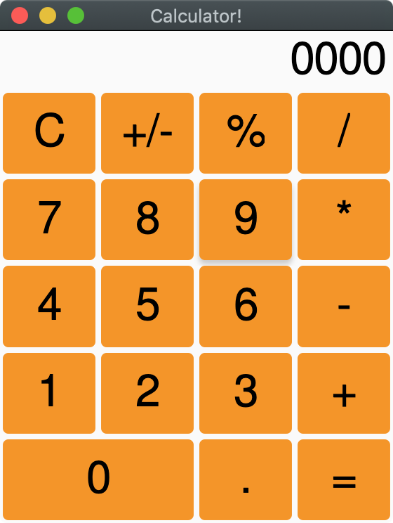

## Imagine

An experimental Rust GUI.

> **WARNING**
>
> This is a work in progress and is not meant to be used in production.

The current implementation is quite messy, but it is meant as a proof of concept and I plan to rewrite the majority of the code if this approach seems viable.

### Basic Design

Imagine uses an ECS library (specs) which maintains all the widgets in the world.
Widgets are composed of various components which is used to determine layout, rendering, and interactivity.
Currently the bulk of the layout and render work is done via trait objects and a single Widget component which stores the Widget trit object.
This benefit of this approach is that it allows anyone to build their own custom widgets in a separate crate.
To demonstrate this, all the available widgets are in the `imagine_toolkit` crate rather than the `imagine` crate.
Widgets are identifiable by a `WidgetId` which is a wrapper over a specs `Entity`. A `WidgetId` is only constructed when an entity with a widget component has been added to the `World`.
Widgets can store these `WidgetId`s to keep track of their children.
End users use `WidgetId`s to build their UI hierarchy and to attach event listeners to widgets.

### Current Features

- Widgets
  - Flex Box
  - Padding
  - Label
  - Button
  - Colored Box
- Basic Interactivity
  - Hover
  - Click

### Example

**Calculator**

### Inspiration

The layout is done via Flutter's box constraints and I have taken a lot of inspiration from
[druid](https://github.com/xi-editor/druid).
